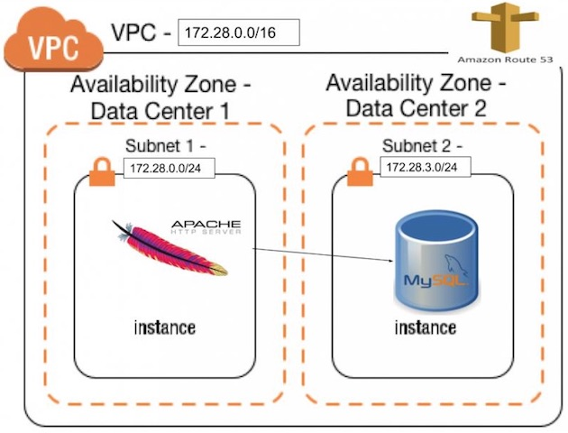
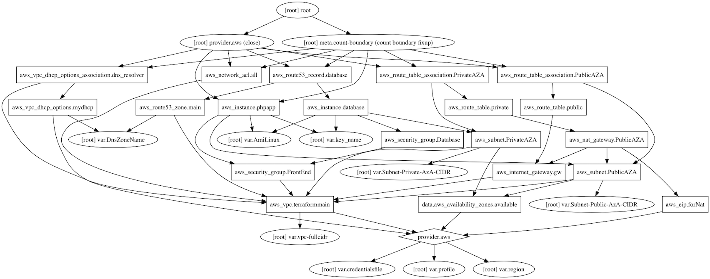
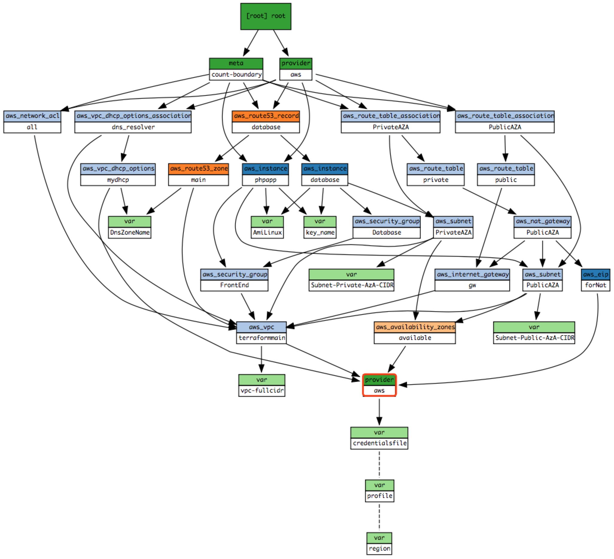

A COMPLETE AWS ENVIRONMENT WITH TERRAFORM
--------------------------------------------

REF：
- https://github.com/giuseppeborgese/a-complete-aws-environment-with-terraform
- https://linuxacademy.com/howtoguides/posts/show/topic/13922-a-complete-aws-environment-with-terraform

# prepare

create a keypair with name "test-terraform"

# graph

## diagram



## generate with graphviz
```
//install graphviz
$ brew install graphviz

$ terraform graph | dot -Tpng > graph.png
```



# interactive visualization

Interactive visualizations of Terraform dependency graphs
```
$ sudo pip3 install BlastRadius
$ sudo blast-radius --serve `pwd`
 * Serving Flask app "blastradius.server.server" (lazy loading)
 * Environment: production
   WARNING: Do not use the development server in a production environment.
   Use a production WSGI server instead.
 * Debug mode: off
 * Running on http://0.0.0.0:5000/ (Press CTRL+C to quit)
```

open http://0.0.0.0:5000 in web browser




# plan

```
$ terraform plan
Refreshing Terraform state in-memory prior to plan...
The refreshed state will be used to calculate this plan, but will not be
persisted to local or remote state storage.

data.aws_availability_zones.available: Refreshing state...

------------------------------------------------------------------------

An execution plan has been generated and is shown below.
Resource actions are indicated with the following symbols:
  + create

Terraform will perform the following actions:

  + aws_eip.forNat
      id:                                          <computed>
      allocation_id:                               <computed>
      association_id:                              <computed>
      domain:                                      <computed>
      instance:                                    <computed>
      network_interface:                           <computed>
      private_ip:                                  <computed>
      public_ip:                                   <computed>
      vpc:                                         "true"

  + aws_instance.database
      id:                                          <computed>
      ami:                                         "ami-ea87a78f"
      associate_public_ip_address:                 "false"
      availability_zone:                           <computed>
      cpu_core_count:                              <computed>
      cpu_threads_per_core:                        <computed>
      ebs_block_device.#:                          <computed>
      ephemeral_block_device.#:                    <computed>
      get_password_data:                           "false"
      instance_state:                              <computed>
      instance_type:                               "t2.nano"
      ipv6_address_count:                          <computed>
      ipv6_addresses.#:                            <computed>
      key_name:                                    "demotmp"
      network_interface.#:                         <computed>
      network_interface_id:                        <computed>
      password_data:                               <computed>
      placement_group:                             <computed>
      primary_network_interface_id:                <computed>
      private_dns:                                 <computed>
      private_ip:                                  <computed>
      public_dns:                                  <computed>
      public_ip:                                   <computed>
      root_block_device.#:                         <computed>
      security_groups.#:                           <computed>
      source_dest_check:                           "true"
      subnet_id:                                   "${aws_subnet.PrivateAZA.id}"
      tags.%:                                      "1"
      tags.Name:                                   "database"
      tenancy:                                     <computed>
      user_data:                                   "8647f337ffbd4a4216a96a988819aa775884a940"
      volume_tags.%:                               <computed>
      vpc_security_group_ids.#:                    <computed>

  + aws_instance.phpapp
      id:                                          <computed>
      ami:                                         "ami-ea87a78f"
      associate_public_ip_address:                 "true"
      availability_zone:                           <computed>
      cpu_core_count:                              <computed>
      cpu_threads_per_core:                        <computed>
      ebs_block_device.#:                          <computed>
      ephemeral_block_device.#:                    <computed>
      get_password_data:                           "false"
      instance_state:                              <computed>
      instance_type:                               "t2.nano"
      ipv6_address_count:                          <computed>
      ipv6_addresses.#:                            <computed>
      key_name:                                    "demotmp"
      network_interface.#:                         <computed>
      network_interface_id:                        <computed>
      password_data:                               <computed>
      placement_group:                             <computed>
      primary_network_interface_id:                <computed>
      private_dns:                                 <computed>
      private_ip:                                  <computed>
      public_dns:                                  <computed>
      public_ip:                                   <computed>
      root_block_device.#:                         <computed>
      security_groups.#:                           <computed>
      source_dest_check:                           "true"
      subnet_id:                                   "${aws_subnet.PublicAZA.id}"
      tags.%:                                      "1"
      tags.Name:                                   "phpapp"
      tenancy:                                     <computed>
      user_data:                                   "fda97eee2e16a2114ca9f5b2063163c5e4a03a1c"
      volume_tags.%:                               <computed>
      vpc_security_group_ids.#:                    <computed>

  + aws_internet_gateway.gw
      id:                                          <computed>
      tags.%:                                      "1"
      tags.Name:                                   "internet gw terraform generated"
      vpc_id:                                      "${aws_vpc.terraformmain.id}"

  + aws_nat_gateway.PublicAZA
      id:                                          <computed>
      allocation_id:                               "${aws_eip.forNat.id}"
      network_interface_id:                        <computed>
      private_ip:                                  <computed>
      public_ip:                                   <computed>
      subnet_id:                                   "${aws_subnet.PublicAZA.id}"

  + aws_network_acl.all
      id:                                          <computed>
      egress.#:                                    "1"
      egress.2943206146.action:                    "allow"
      egress.2943206146.cidr_block:                "0.0.0.0/0"
      egress.2943206146.from_port:                 "0"
      egress.2943206146.icmp_code:                 ""
      egress.2943206146.icmp_type:                 ""
      egress.2943206146.ipv6_cidr_block:           ""
      egress.2943206146.protocol:                  "-1"
      egress.2943206146.rule_no:                   "2"
      egress.2943206146.to_port:                   "0"
      ingress.#:                                   "1"
      ingress.1564094202.action:                   "allow"
      ingress.1564094202.cidr_block:               "0.0.0.0/0"
      ingress.1564094202.from_port:                "0"
      ingress.1564094202.icmp_code:                ""
      ingress.1564094202.icmp_type:                ""
      ingress.1564094202.ipv6_cidr_block:          ""
      ingress.1564094202.protocol:                 "-1"
      ingress.1564094202.rule_no:                  "1"
      ingress.1564094202.to_port:                  "0"
      subnet_ids.#:                                <computed>
      tags.%:                                      "1"
      tags.Name:                                   "open acl"
      vpc_id:                                      "${aws_vpc.terraformmain.id}"

  + aws_route53_record.database
      id:                                          <computed>
      allow_overwrite:                             "true"
      fqdn:                                        <computed>
      name:                                        "mydatabase.linuxacademy.internal"
      records.#:                                   <computed>
      ttl:                                         "300"
      type:                                        "A"
      zone_id:                                     "${aws_route53_zone.main.zone_id}"

  + aws_route53_zone.main
      id:                                          <computed>
      comment:                                     "Managed by terraform"
      force_destroy:                               "false"
      name:                                        "linuxacademy.internal"
      name_servers.#:                              <computed>
      vpc_id:                                      "${aws_vpc.terraformmain.id}"
      vpc_region:                                  <computed>
      zone_id:                                     <computed>

  + aws_route_table.private
      id:                                          <computed>
      propagating_vgws.#:                          <computed>
      route.#:                                     "1"
      route.~3197346556.cidr_block:                "0.0.0.0/0"
      route.~3197346556.egress_only_gateway_id:    ""
      route.~3197346556.gateway_id:                ""
      route.~3197346556.instance_id:               ""
      route.~3197346556.ipv6_cidr_block:           ""
      route.~3197346556.nat_gateway_id:            "${aws_nat_gateway.PublicAZA.id}"
      route.~3197346556.network_interface_id:      ""
      route.~3197346556.vpc_peering_connection_id: ""
      tags.%:                                      "1"
      tags.Name:                                   "Private"
      vpc_id:                                      "${aws_vpc.terraformmain.id}"

  + aws_route_table.public
      id:                                          <computed>
      propagating_vgws.#:                          <computed>
      route.#:                                     "1"
      route.~2599208424.cidr_block:                "0.0.0.0/0"
      route.~2599208424.egress_only_gateway_id:    ""
      route.~2599208424.gateway_id:                "${aws_internet_gateway.gw.id}"
      route.~2599208424.instance_id:               ""
      route.~2599208424.ipv6_cidr_block:           ""
      route.~2599208424.nat_gateway_id:            ""
      route.~2599208424.network_interface_id:      ""
      route.~2599208424.vpc_peering_connection_id: ""
      tags.%:                                      "1"
      tags.Name:                                   "Public"
      vpc_id:                                      "${aws_vpc.terraformmain.id}"

  + aws_route_table_association.PrivateAZA
      id:                                          <computed>
      route_table_id:                              "${aws_route_table.private.id}"
      subnet_id:                                   "${aws_subnet.PrivateAZA.id}"

  + aws_route_table_association.PublicAZA
      id:                                          <computed>
      route_table_id:                              "${aws_route_table.public.id}"
      subnet_id:                                   "${aws_subnet.PublicAZA.id}"

  + aws_security_group.Database
      id:                                          <computed>
      arn:                                         <computed>
      description:                                 "ONLY tcp CONNECTION INBOUND"
      egress.#:                                    "1"
      egress.482069346.cidr_blocks.#:              "1"
      egress.482069346.cidr_blocks.0:              "0.0.0.0/0"
      egress.482069346.description:                ""
      egress.482069346.from_port:                  "0"
      egress.482069346.ipv6_cidr_blocks.#:         "0"
      egress.482069346.prefix_list_ids.#:          "0"
      egress.482069346.protocol:                   "-1"
      egress.482069346.security_groups.#:          "0"
      egress.482069346.self:                       "false"
      egress.482069346.to_port:                    "0"
      ingress.#:                                   "2"
      ingress.2541437006.cidr_blocks.#:            "1"
      ingress.2541437006.cidr_blocks.0:            "0.0.0.0/0"
      ingress.2541437006.description:              ""
      ingress.2541437006.from_port:                "22"
      ingress.2541437006.ipv6_cidr_blocks.#:       "0"
      ingress.2541437006.protocol:                 "tcp"
      ingress.2541437006.security_groups.#:        "0"
      ingress.2541437006.self:                     "false"
      ingress.2541437006.to_port:                  "22"
      ingress.~471043921.cidr_blocks.#:            "0"
      ingress.~471043921.description:              ""
      ingress.~471043921.from_port:                "3306"
      ingress.~471043921.ipv6_cidr_blocks.#:       "0"
      ingress.~471043921.protocol:                 "tcp"
      ingress.~471043921.security_groups.#:        <computed>
      ingress.~471043921.self:                     "false"
      ingress.~471043921.to_port:                  "3306"
      name:                                        "Database"
      owner_id:                                    <computed>
      revoke_rules_on_delete:                      "false"
      tags.%:                                      "1"
      tags.Name:                                   "Database"
      vpc_id:                                      "${aws_vpc.terraformmain.id}"

  + aws_security_group.FrontEnd
      id:                                          <computed>
      arn:                                         <computed>
      description:                                 "ONLY HTTP CONNECTION INBOUD"
      egress.#:                                    "1"
      egress.482069346.cidr_blocks.#:              "1"
      egress.482069346.cidr_blocks.0:              "0.0.0.0/0"
      egress.482069346.description:                ""
      egress.482069346.from_port:                  "0"
      egress.482069346.ipv6_cidr_blocks.#:         "0"
      egress.482069346.prefix_list_ids.#:          "0"
      egress.482069346.protocol:                   "-1"
      egress.482069346.security_groups.#:          "0"
      egress.482069346.self:                       "false"
      egress.482069346.to_port:                    "0"
      ingress.#:                                   "2"
      ingress.2214680975.cidr_blocks.#:            "1"
      ingress.2214680975.cidr_blocks.0:            "0.0.0.0/0"
      ingress.2214680975.description:              ""
      ingress.2214680975.from_port:                "80"
      ingress.2214680975.ipv6_cidr_blocks.#:       "0"
      ingress.2214680975.protocol:                 "tcp"
      ingress.2214680975.security_groups.#:        "0"
      ingress.2214680975.self:                     "false"
      ingress.2214680975.to_port:                  "80"
      ingress.2541437006.cidr_blocks.#:            "1"
      ingress.2541437006.cidr_blocks.0:            "0.0.0.0/0"
      ingress.2541437006.description:              ""
      ingress.2541437006.from_port:                "22"
      ingress.2541437006.ipv6_cidr_blocks.#:       "0"
      ingress.2541437006.protocol:                 "tcp"
      ingress.2541437006.security_groups.#:        "0"
      ingress.2541437006.self:                     "false"
      ingress.2541437006.to_port:                  "22"
      name:                                        "FrontEnd"
      owner_id:                                    <computed>
      revoke_rules_on_delete:                      "false"
      tags.%:                                      "1"
      tags.Name:                                   "FrontEnd"
      vpc_id:                                      "${aws_vpc.terraformmain.id}"

  + aws_subnet.PrivateAZA
      id:                                          <computed>
      assign_ipv6_address_on_creation:             "false"
      availability_zone:                           "us-east-2b"
      cidr_block:                                  "172.28.3.0/24"
      ipv6_cidr_block:                             <computed>
      ipv6_cidr_block_association_id:              <computed>
      map_public_ip_on_launch:                     "false"
      tags.%:                                      "1"
      tags.Name:                                   "PublicAZB"
      vpc_id:                                      "${aws_vpc.terraformmain.id}"

  + aws_subnet.PublicAZA
      id:                                          <computed>
      assign_ipv6_address_on_creation:             "false"
      availability_zone:                           "us-east-2a"
      cidr_block:                                  "172.28.0.0/24"
      ipv6_cidr_block:                             <computed>
      ipv6_cidr_block_association_id:              <computed>
      map_public_ip_on_launch:                     "false"
      tags.%:                                      "1"
      tags.Name:                                   "PublicAZA"
      vpc_id:                                      "${aws_vpc.terraformmain.id}"

  + aws_vpc.terraformmain
      id:                                          <computed>
      arn:                                         <computed>
      assign_generated_ipv6_cidr_block:            "false"
      cidr_block:                                  "172.28.0.0/16"
      default_network_acl_id:                      <computed>
      default_route_table_id:                      <computed>
      default_security_group_id:                   <computed>
      dhcp_options_id:                             <computed>
      enable_classiclink:                          <computed>
      enable_classiclink_dns_support:              <computed>
      enable_dns_hostnames:                        "true"
      enable_dns_support:                          "true"
      instance_tenancy:                            "default"
      ipv6_association_id:                         <computed>
      ipv6_cidr_block:                             <computed>
      main_route_table_id:                         <computed>
      tags.%:                                      "1"
      tags.Name:                                   "My terraform vpc"

  + aws_vpc_dhcp_options.mydhcp
      id:                                          <computed>
      domain_name:                                 "linuxacademy.internal"
      domain_name_servers.#:                       "1"
      domain_name_servers.0:                       "AmazonProvidedDNS"
      tags.%:                                      "1"
      tags.Name:                                   "My internal name"

  + aws_vpc_dhcp_options_association.dns_resolver
      id:                                          <computed>
      dhcp_options_id:                             "${aws_vpc_dhcp_options.mydhcp.id}"
      vpc_id:                                      "${aws_vpc.terraformmain.id}"


Plan: 19 to add, 0 to change, 0 to destroy.

------------------------------------------------------------------------

Note: You didn't specify an "-out" parameter to save this plan, so Terraform
can't guarantee that exactly these actions will be performed if
"terraform apply" is subsequently run.
```

# apply

> It took about 6 minutes

```
$ terraform apply
...
Do you want to perform these actions?
  Terraform will perform the actions described above.
  Only 'yes' will be accepted to approve.

  Enter a value: yes

aws_eip.forNat: Creating...
  allocation_id:     "" => "<computed>"
  association_id:    "" => "<computed>"
  domain:            "" => "<computed>"
  instance:          "" => "<computed>"
  network_interface: "" => "<computed>"
  private_ip:        "" => "<computed>"
  public_ip:         "" => "<computed>"
  vpc:               "" => "true"
aws_vpc_dhcp_options.mydhcp: Creating...
  domain_name:           "" => "linuxacademy.internal"
  domain_name_servers.#: "" => "1"
  domain_name_servers.0: "" => "AmazonProvidedDNS"
  tags.%:                "" => "1"
  tags.Name:             "" => "My internal name"
aws_vpc.terraformmain: Creating...
  arn:                              "" => "<computed>"
  assign_generated_ipv6_cidr_block: "" => "false"
  cidr_block:                       "" => "172.28.0.0/16"
  default_network_acl_id:           "" => "<computed>"
  default_route_table_id:           "" => "<computed>"
  default_security_group_id:        "" => "<computed>"
  dhcp_options_id:                  "" => "<computed>"
  enable_classiclink:               "" => "<computed>"
  enable_classiclink_dns_support:   "" => "<computed>"
  enable_dns_hostnames:             "" => "true"
  enable_dns_support:               "" => "true"
  instance_tenancy:                 "" => "default"
  ipv6_association_id:              "" => "<computed>"
  ipv6_cidr_block:                  "" => "<computed>"
  main_route_table_id:              "" => "<computed>"
  tags.%:                           "" => "1"
  tags.Name:                        "" => "My terraform vpc"
aws_eip.forNat: Creation complete after 3s (ID: eipalloc-d34180f2)
aws_vpc_dhcp_options.mydhcp: Creation complete after 4s (ID: dopt-02e6ed6a)
aws_vpc.terraformmain: Still creating... (10s elapsed)
aws_vpc.terraformmain: Creation complete after 18s (ID: vpc-9e7b4af6)
aws_vpc_dhcp_options_association.dns_resolver: Creating...
  dhcp_options_id: "" => "dopt-02e6ed6a"
  vpc_id:          "" => "vpc-9e7b4af6"
aws_subnet.PrivateAZA: Creating...
  assign_ipv6_address_on_creation: "" => "false"
  availability_zone:               "" => "us-east-2b"
  cidr_block:                      "" => "172.28.3.0/24"
  ipv6_cidr_block:                 "" => "<computed>"
  ipv6_cidr_block_association_id:  "" => "<computed>"
  map_public_ip_on_launch:         "" => "false"
  tags.%:                          "" => "1"
  tags.Name:                       "" => "PublicAZB"
  vpc_id:                          "" => "vpc-9e7b4af6"
aws_route53_zone.main: Creating...
  comment:        "" => "Managed by terraform"
  force_destroy:  "" => "false"
  name:           "" => "linuxacademy.internal"
  name_servers.#: "" => "<computed>"
  vpc_id:         "" => "vpc-9e7b4af6"
  vpc_region:     "" => "<computed>"
  zone_id:        "" => "<computed>"
aws_internet_gateway.gw: Creating...
  tags.%:    "0" => "1"
  tags.Name: "" => "internet gw terraform generated"
  vpc_id:    "" => "vpc-9e7b4af6"
aws_subnet.PublicAZA: Creating...
  assign_ipv6_address_on_creation: "" => "false"
  availability_zone:               "" => "us-east-2a"
  cidr_block:                      "" => "172.28.0.0/24"
  ipv6_cidr_block:                 "" => "<computed>"
  ipv6_cidr_block_association_id:  "" => "<computed>"
  map_public_ip_on_launch:         "" => "false"
  tags.%:                          "" => "1"
  tags.Name:                       "" => "PublicAZA"
  vpc_id:                          "" => "vpc-9e7b4af6"
aws_network_acl.all: Creating...
  egress.#:                           "" => "1"
  egress.2943206146.action:           "" => "allow"
  egress.2943206146.cidr_block:       "" => "0.0.0.0/0"
  egress.2943206146.from_port:        "" => "0"
  egress.2943206146.icmp_code:        "" => ""
  egress.2943206146.icmp_type:        "" => ""
  egress.2943206146.ipv6_cidr_block:  "" => ""
  egress.2943206146.protocol:         "" => "-1"
  egress.2943206146.rule_no:          "" => "2"
  egress.2943206146.to_port:          "" => "0"
  ingress.#:                          "" => "1"
  ingress.1564094202.action:          "" => "allow"
  ingress.1564094202.cidr_block:      "" => "0.0.0.0/0"
  ingress.1564094202.from_port:       "" => "0"
  ingress.1564094202.icmp_code:       "" => ""
  ingress.1564094202.icmp_type:       "" => ""
  ingress.1564094202.ipv6_cidr_block: "" => ""
  ingress.1564094202.protocol:        "" => "-1"
  ingress.1564094202.rule_no:         "" => "1"
  ingress.1564094202.to_port:         "" => "0"
  subnet_ids.#:                       "" => "<computed>"
  tags.%:                             "" => "1"
  tags.Name:                          "" => "open acl"
  vpc_id:                             "" => "vpc-9e7b4af6"
aws_security_group.FrontEnd: Creating...
  arn:                                   "" => "<computed>"
  description:                           "" => "ONLY HTTP CONNECTION INBOUD"
  egress.#:                              "" => "1"
  egress.482069346.cidr_blocks.#:        "" => "1"
  egress.482069346.cidr_blocks.0:        "" => "0.0.0.0/0"
  egress.482069346.description:          "" => ""
  egress.482069346.from_port:            "" => "0"
  egress.482069346.ipv6_cidr_blocks.#:   "" => "0"
  egress.482069346.prefix_list_ids.#:    "" => "0"
  egress.482069346.protocol:             "" => "-1"
  egress.482069346.security_groups.#:    "" => "0"
  egress.482069346.self:                 "" => "false"
  egress.482069346.to_port:              "" => "0"
  ingress.#:                             "" => "2"
  ingress.2214680975.cidr_blocks.#:      "" => "1"
  ingress.2214680975.cidr_blocks.0:      "" => "0.0.0.0/0"
  ingress.2214680975.description:        "" => ""
  ingress.2214680975.from_port:          "" => "80"
  ingress.2214680975.ipv6_cidr_blocks.#: "" => "0"
  ingress.2214680975.protocol:           "" => "tcp"
  ingress.2214680975.security_groups.#:  "" => "0"
  ingress.2214680975.self:               "" => "false"
  ingress.2214680975.to_port:            "" => "80"
  ingress.2541437006.cidr_blocks.#:      "" => "1"
  ingress.2541437006.cidr_blocks.0:      "" => "0.0.0.0/0"
  ingress.2541437006.description:        "" => ""
  ingress.2541437006.from_port:          "" => "22"
  ingress.2541437006.ipv6_cidr_blocks.#: "" => "0"
  ingress.2541437006.protocol:           "" => "tcp"
  ingress.2541437006.security_groups.#:  "" => "0"
  ingress.2541437006.self:               "" => "false"
  ingress.2541437006.to_port:            "" => "22"
  name:                                  "" => "FrontEnd"
  owner_id:                              "" => "<computed>"
  revoke_rules_on_delete:                "" => "false"
  tags.%:                                "" => "1"
  tags.Name:                             "" => "FrontEnd"
  vpc_id:                                "" => "vpc-9e7b4af6"
aws_vpc_dhcp_options_association.dns_resolver: Creation complete after 2s (ID: dopt-02e6ed6a-vpc-9e7b4af6)
aws_subnet.PublicAZA: Creation complete after 5s (ID: subnet-2b762f43)
aws_subnet.PrivateAZA: Creation complete after 5s (ID: subnet-ea47d090)
aws_internet_gateway.gw: Creation complete after 6s (ID: igw-fc23f094)
aws_network_acl.all: Creation complete after 6s (ID: acl-4318042b)
aws_nat_gateway.PublicAZA: Creating...
  allocation_id:        "" => "eipalloc-d34180f2"
  network_interface_id: "" => "<computed>"
  private_ip:           "" => "<computed>"
  public_ip:            "" => "<computed>"
  subnet_id:            "" => "subnet-2b762f43"
aws_route_table.public: Creating...
  propagating_vgws.#:                        "" => "<computed>"
  route.#:                                   "" => "1"
  route.550219441.cidr_block:                "" => "0.0.0.0/0"
  route.550219441.egress_only_gateway_id:    "" => ""
  route.550219441.gateway_id:                "" => "igw-fc23f094"
  route.550219441.instance_id:               "" => ""
  route.550219441.ipv6_cidr_block:           "" => ""
  route.550219441.nat_gateway_id:            "" => ""
  route.550219441.network_interface_id:      "" => ""
  route.550219441.vpc_peering_connection_id: "" => ""
  tags.%:                                    "" => "1"
  tags.Name:                                 "" => "Public"
  vpc_id:                                    "" => "vpc-9e7b4af6"
aws_route53_zone.main: Still creating... (10s elapsed)
aws_security_group.FrontEnd: Still creating... (10s elapsed)
aws_security_group.FrontEnd: Creation complete after 12s (ID: sg-72575f18)
aws_instance.phpapp: Creating...
  ami:                               "" => "ami-ea87a78f"
  associate_public_ip_address:       "" => "true"
  availability_zone:                 "" => "<computed>"
  cpu_core_count:                    "" => "<computed>"
  cpu_threads_per_core:              "" => "<computed>"
  ebs_block_device.#:                "" => "<computed>"
  ephemeral_block_device.#:          "" => "<computed>"
  get_password_data:                 "" => "false"
  instance_state:                    "" => "<computed>"
  instance_type:                     "" => "t2.nano"
  ipv6_address_count:                "" => "<computed>"
  ipv6_addresses.#:                  "" => "<computed>"
  key_name:                          "" => "demotmp"
  network_interface.#:               "" => "<computed>"
  network_interface_id:              "" => "<computed>"
  password_data:                     "" => "<computed>"
  placement_group:                   "" => "<computed>"
  primary_network_interface_id:      "" => "<computed>"
  private_dns:                       "" => "<computed>"
  private_ip:                        "" => "<computed>"
  public_dns:                        "" => "<computed>"
  public_ip:                         "" => "<computed>"
  root_block_device.#:               "" => "<computed>"
  security_groups.#:                 "" => "<computed>"
  source_dest_check:                 "" => "true"
  subnet_id:                         "" => "subnet-2b762f43"
  tags.%:                            "" => "1"
  tags.Name:                         "" => "phpapp"
  tenancy:                           "" => "<computed>"
  user_data:                         "" => "fda97eee2e16a2114ca9f5b2063163c5e4a03a1c"
  volume_tags.%:                     "" => "<computed>"
  vpc_security_group_ids.#:          "" => "1"
  vpc_security_group_ids.3731940185: "" => "sg-72575f18"
aws_security_group.Database: Creating...
  arn:                                           "" => "<computed>"
  description:                                   "" => "ONLY tcp CONNECTION INBOUND"
  egress.#:                                      "" => "1"
  egress.482069346.cidr_blocks.#:                "" => "1"
  egress.482069346.cidr_blocks.0:                "" => "0.0.0.0/0"
  egress.482069346.description:                  "" => ""
  egress.482069346.from_port:                    "" => "0"
  egress.482069346.ipv6_cidr_blocks.#:           "" => "0"
  egress.482069346.prefix_list_ids.#:            "" => "0"
  egress.482069346.protocol:                     "" => "-1"
  egress.482069346.security_groups.#:            "" => "0"
  egress.482069346.self:                         "" => "false"
  egress.482069346.to_port:                      "" => "0"
  ingress.#:                                     "" => "2"
  ingress.1075738367.cidr_blocks.#:              "" => "0"
  ingress.1075738367.description:                "" => ""
  ingress.1075738367.from_port:                  "" => "3306"
  ingress.1075738367.ipv6_cidr_blocks.#:         "" => "0"
  ingress.1075738367.protocol:                   "" => "tcp"
  ingress.1075738367.security_groups.#:          "" => "1"
  ingress.1075738367.security_groups.3731940185: "" => "sg-72575f18"
  ingress.1075738367.self:                       "" => "false"
  ingress.1075738367.to_port:                    "" => "3306"
  ingress.2541437006.cidr_blocks.#:              "" => "1"
  ingress.2541437006.cidr_blocks.0:              "" => "0.0.0.0/0"
  ingress.2541437006.description:                "" => ""
  ingress.2541437006.from_port:                  "" => "22"
  ingress.2541437006.ipv6_cidr_blocks.#:         "" => "0"
  ingress.2541437006.protocol:                   "" => "tcp"
  ingress.2541437006.security_groups.#:          "" => "0"
  ingress.2541437006.self:                       "" => "false"
  ingress.2541437006.to_port:                    "" => "22"
  name:                                          "" => "Database"
  owner_id:                                      "" => "<computed>"
  revoke_rules_on_delete:                        "" => "false"
  tags.%:                                        "" => "1"
  tags.Name:                                     "" => "Database"
  vpc_id:                                        "" => "vpc-9e7b4af6"
aws_route_table.public: Creation complete after 7s (ID: rtb-c9c23ca2)
aws_route_table_association.PublicAZA: Creating...
  route_table_id: "" => "rtb-c9c23ca2"
  subnet_id:      "" => "subnet-2b762f43"
aws_route_table_association.PublicAZA: Creation complete after 1s (ID: rtbassoc-990634f2)
aws_nat_gateway.PublicAZA: Still creating... (10s elapsed)
aws_route53_zone.main: Still creating... (20s elapsed)
aws_security_group.Database: Still creating... (10s elapsed)
aws_security_group.Database: Creation complete after 12s (ID: sg-9b6860f1)
aws_instance.database: Creating...
  ami:                              "" => "ami-ea87a78f"
  associate_public_ip_address:      "" => "false"
  availability_zone:                "" => "<computed>"
  cpu_core_count:                   "" => "<computed>"
  cpu_threads_per_core:             "" => "<computed>"
  ebs_block_device.#:               "" => "<computed>"
  ephemeral_block_device.#:         "" => "<computed>"
  get_password_data:                "" => "false"
  instance_state:                   "" => "<computed>"
  instance_type:                    "" => "t2.nano"
  ipv6_address_count:               "" => "<computed>"
  ipv6_addresses.#:                 "" => "<computed>"
  key_name:                         "" => "demotmp"
  network_interface.#:              "" => "<computed>"
  network_interface_id:             "" => "<computed>"
  password_data:                    "" => "<computed>"
  placement_group:                  "" => "<computed>"
  primary_network_interface_id:     "" => "<computed>"
  private_dns:                      "" => "<computed>"
  private_ip:                       "" => "<computed>"
  public_dns:                       "" => "<computed>"
  public_ip:                        "" => "<computed>"
  root_block_device.#:              "" => "<computed>"
  security_groups.#:                "" => "<computed>"
  source_dest_check:                "" => "true"
  subnet_id:                        "" => "subnet-ea47d090"
  tags.%:                           "" => "1"
  tags.Name:                        "" => "database"
  tenancy:                          "" => "<computed>"
  user_data:                        "" => "8647f337ffbd4a4216a96a988819aa775884a940"
  volume_tags.%:                    "" => "<computed>"
  vpc_security_group_ids.#:         "" => "1"
  vpc_security_group_ids.441021304: "" => "sg-9b6860f1"
aws_nat_gateway.PublicAZA: Still creating... (20s elapsed)
aws_route53_zone.main: Still creating... (30s elapsed)
aws_nat_gateway.PublicAZA: Still creating... (30s elapsed)
aws_nat_gateway.PublicAZA: Still creating... (40s elapsed)
aws_nat_gateway.PublicAZA: Still creating... (50s elapsed)
aws_nat_gateway.PublicAZA: Still creating... (1m0s elapsed)
aws_nat_gateway.PublicAZA: Still creating... (1m10s elapsed)
aws_nat_gateway.PublicAZA: Still creating... (1m20s elapsed)
aws_nat_gateway.PublicAZA: Still creating... (1m30s elapsed)
aws_nat_gateway.PublicAZA: Still creating... (1m40s elapsed)
aws_nat_gateway.PublicAZA: Creation complete after 1m45s (ID: nat-0ebf84a7676bb2445)
aws_route_table.private: Creating...
  propagating_vgws.#:                        "" => "<computed>"
  route.#:                                   "" => "1"
  route.219894106.cidr_block:                "" => "0.0.0.0/0"
  route.219894106.egress_only_gateway_id:    "" => ""
  route.219894106.gateway_id:                "" => ""
  route.219894106.instance_id:               "" => ""
  route.219894106.ipv6_cidr_block:           "" => ""
  route.219894106.nat_gateway_id:            "" => "nat-0ebf84a7676bb2445"
  route.219894106.network_interface_id:      "" => ""
  route.219894106.vpc_peering_connection_id: "" => ""
  tags.%:                                    "" => "1"
  tags.Name:                                 "" => "Private"
  vpc_id:                                    "" => "vpc-9e7b4af6"
aws_route_table.private: Creation complete after 6s (ID: rtb-03c23c68)
aws_route_table_association.PrivateAZA: Creating...
  route_table_id: "" => "rtb-03c23c68"
  subnet_id:      "" => "subnet-ea47d090"
aws_route_table_association.PrivateAZA: Creation complete after 2s (ID: rtbassoc-e8013383)
> break twice due to missing keypair and user has no R53 permission

> continue apply after fix the above problems
aws_route_table_association.PrivateAZA: Destroying... (ID: rtbassoc-e8013383)
aws_route_table_association.PublicAZA: Destroying... (ID: rtbassoc-990634f2)
aws_route53_zone.main: Destroying... (ID: Z1KEVP6G1P7AZE)
aws_eip.forNat: Creating...
  allocation_id:     "" => "<computed>"
  association_id:    "" => "<computed>"
  domain:            "" => "<computed>"
  instance:          "" => "<computed>"
  network_interface: "" => "<computed>"
  private_ip:        "" => "<computed>"
  public_ip:         "" => "<computed>"
  vpc:               "" => "true"
aws_vpc_dhcp_options.mydhcp: Creating...
  domain_name:           "" => "linuxacademy.internal"
  domain_name_servers.#: "" => "1"
  domain_name_servers.0: "" => "AmazonProvidedDNS"
  tags.%:                "" => "1"
  tags.Name:             "" => "My internal name"
aws_vpc.terraformmain: Creating...
  arn:                              "" => "<computed>"
  assign_generated_ipv6_cidr_block: "" => "false"
  cidr_block:                       "" => "172.28.0.0/16"
  default_network_acl_id:           "" => "<computed>"
  default_route_table_id:           "" => "<computed>"
  default_security_group_id:        "" => "<computed>"
  dhcp_options_id:                  "" => "<computed>"
  enable_classiclink:               "" => "<computed>"
  enable_classiclink_dns_support:   "" => "<computed>"
  enable_dns_hostnames:             "" => "true"
  enable_dns_support:               "" => "true"
  instance_tenancy:                 "" => "default"
  ipv6_association_id:              "" => "<computed>"
  ipv6_cidr_block:                  "" => "<computed>"
  main_route_table_id:              "" => "<computed>"
  tags.%:                           "" => "1"
  tags.Name:                        "" => "My terraform vpc"
aws_route_table_association.PrivateAZA: Destruction complete after 2s
aws_route_table_association.PublicAZA: Destruction complete after 2s
aws_eip.forNat: Creation complete after 3s (ID: eipalloc-cf0c16f5)
aws_route53_zone.main: Destruction complete after 4s
aws_vpc_dhcp_options.mydhcp: Creation complete after 4s (ID: dopt-bca2f1db)
aws_vpc.terraformmain: Still creating... (10s elapsed)
aws_vpc.terraformmain: Creation complete after 20s (ID: vpc-0b9bc36c)
aws_internet_gateway.gw: Creating...
  tags.%:    "0" => "1"
  tags.Name: "" => "internet gw terraform generated"
  vpc_id:    "" => "vpc-0b9bc36c"
aws_vpc_dhcp_options_association.dns_resolver: Modifying... (ID: dopt-02e6ed6a-vpc-9e7b4af6)
  dhcp_options_id: "dopt-02e6ed6a" => "dopt-bca2f1db"
  vpc_id:          "vpc-9e7b4af6" => "vpc-0b9bc36c"
aws_route53_zone.main: Creating...
  comment:        "" => "Managed by terraform"
  force_destroy:  "" => "false"
  name:           "" => "linuxacademy.internal"
  name_servers.#: "" => "<computed>"
  vpc_id:         "" => "vpc-0b9bc36c"
  vpc_region:     "" => "<computed>"
  zone_id:        "" => "<computed>"
aws_subnet.PrivateAZA: Creating...
  assign_ipv6_address_on_creation: "" => "false"
  availability_zone:               "" => "ap-southeast-1b"
  cidr_block:                      "" => "172.28.3.0/24"
  ipv6_cidr_block:                 "" => "<computed>"
  ipv6_cidr_block_association_id:  "" => "<computed>"
  map_public_ip_on_launch:         "" => "false"
  tags.%:                          "" => "1"
  tags.Name:                       "" => "PublicAZB"
  vpc_id:                          "" => "vpc-0b9bc36c"
aws_subnet.PublicAZA: Creating...
  assign_ipv6_address_on_creation: "" => "false"
  availability_zone:               "" => "ap-southeast-1a"
  cidr_block:                      "" => "172.28.0.0/24"
  ipv6_cidr_block:                 "" => "<computed>"
  ipv6_cidr_block_association_id:  "" => "<computed>"
  map_public_ip_on_launch:         "" => "false"
  tags.%:                          "" => "1"
  tags.Name:                       "" => "PublicAZA"
  vpc_id:                          "" => "vpc-0b9bc36c"
aws_network_acl.all: Creating...
  egress.#:                           "" => "1"
  egress.2943206146.action:           "" => "allow"
  egress.2943206146.cidr_block:       "" => "0.0.0.0/0"
  egress.2943206146.from_port:        "" => "0"
  egress.2943206146.icmp_code:        "" => ""
  egress.2943206146.icmp_type:        "" => ""
  egress.2943206146.ipv6_cidr_block:  "" => ""
  egress.2943206146.protocol:         "" => "-1"
  egress.2943206146.rule_no:          "" => "2"
  egress.2943206146.to_port:          "" => "0"
  ingress.#:                          "" => "1"
  ingress.1564094202.action:          "" => "allow"
  ingress.1564094202.cidr_block:      "" => "0.0.0.0/0"
  ingress.1564094202.from_port:       "" => "0"
  ingress.1564094202.icmp_code:       "" => ""
  ingress.1564094202.icmp_type:       "" => ""
  ingress.1564094202.ipv6_cidr_block: "" => ""
  ingress.1564094202.protocol:        "" => "-1"
  ingress.1564094202.rule_no:         "" => "1"
  ingress.1564094202.to_port:         "" => "0"
  subnet_ids.#:                       "" => "<computed>"
  tags.%:                             "" => "1"
  tags.Name:                          "" => "open acl"
  vpc_id:                             "" => "vpc-0b9bc36c"
aws_security_group.FrontEnd: Creating...
  arn:                                   "" => "<computed>"
  description:                           "" => "ONLY HTTP CONNECTION INBOUD"
  egress.#:                              "" => "1"
  egress.482069346.cidr_blocks.#:        "" => "1"
  egress.482069346.cidr_blocks.0:        "" => "0.0.0.0/0"
  egress.482069346.description:          "" => ""
  egress.482069346.from_port:            "" => "0"
  egress.482069346.ipv6_cidr_blocks.#:   "" => "0"
  egress.482069346.prefix_list_ids.#:    "" => "0"
  egress.482069346.protocol:             "" => "-1"
  egress.482069346.security_groups.#:    "" => "0"
  egress.482069346.self:                 "" => "false"
  egress.482069346.to_port:              "" => "0"
  ingress.#:                             "" => "2"
  ingress.2214680975.cidr_blocks.#:      "" => "1"
  ingress.2214680975.cidr_blocks.0:      "" => "0.0.0.0/0"
  ingress.2214680975.description:        "" => ""
  ingress.2214680975.from_port:          "" => "80"
  ingress.2214680975.ipv6_cidr_blocks.#: "" => "0"
  ingress.2214680975.protocol:           "" => "tcp"
  ingress.2214680975.security_groups.#:  "" => "0"
  ingress.2214680975.self:               "" => "false"
  ingress.2214680975.to_port:            "" => "80"
  ingress.2541437006.cidr_blocks.#:      "" => "1"
  ingress.2541437006.cidr_blocks.0:      "" => "0.0.0.0/0"
  ingress.2541437006.description:        "" => ""
  ingress.2541437006.from_port:          "" => "22"
  ingress.2541437006.ipv6_cidr_blocks.#: "" => "0"
  ingress.2541437006.protocol:           "" => "tcp"
  ingress.2541437006.security_groups.#:  "" => "0"
  ingress.2541437006.self:               "" => "false"
  ingress.2541437006.to_port:            "" => "22"
  name:                                  "" => "FrontEnd"
  owner_id:                              "" => "<computed>"
  revoke_rules_on_delete:                "" => "false"
  tags.%:                                "" => "1"
  tags.Name:                             "" => "FrontEnd"
  vpc_id:                                "" => "vpc-0b9bc36c"
aws_vpc_dhcp_options_association.dns_resolver: Modifications complete after 2s (ID: dopt-bca2f1db-vpc-0b9bc36c)
aws_subnet.PrivateAZA: Creation complete after 5s (ID: subnet-22929e45)
aws_subnet.PublicAZA: Creation complete after 5s (ID: subnet-7d1d2134)
aws_network_acl.all: Creation complete after 6s (ID: acl-db1bd9bd)
aws_internet_gateway.gw: Creation complete after 7s (ID: igw-f5374d91)
aws_nat_gateway.PublicAZA: Creating...
  allocation_id:        "" => "eipalloc-cf0c16f5"
  network_interface_id: "" => "<computed>"
  private_ip:           "" => "<computed>"
  public_ip:            "" => "<computed>"
  subnet_id:            "" => "subnet-7d1d2134"
aws_route_table.public: Creating...
  propagating_vgws.#:                         "" => "<computed>"
  route.#:                                    "" => "1"
  route.1656688728.cidr_block:                "" => "0.0.0.0/0"
  route.1656688728.egress_only_gateway_id:    "" => ""
  route.1656688728.gateway_id:                "" => "igw-f5374d91"
  route.1656688728.instance_id:               "" => ""
  route.1656688728.ipv6_cidr_block:           "" => ""
  route.1656688728.nat_gateway_id:            "" => ""
  route.1656688728.network_interface_id:      "" => ""
  route.1656688728.vpc_peering_connection_id: "" => ""
  tags.%:                                     "" => "1"
  tags.Name:                                  "" => "Public"
  vpc_id:                                     "" => "vpc-0b9bc36c"
aws_route53_zone.main: Still creating... (10s elapsed)
aws_security_group.FrontEnd: Still creating... (10s elapsed)
aws_security_group.FrontEnd: Creation complete after 13s (ID: sg-49e85f31)
aws_instance.phpapp: Creating...
  ami:                               "" => "ami-68097514"
  associate_public_ip_address:       "" => "true"
  availability_zone:                 "" => "<computed>"
  cpu_core_count:                    "" => "<computed>"
  cpu_threads_per_core:              "" => "<computed>"
  ebs_block_device.#:                "" => "<computed>"
  ephemeral_block_device.#:          "" => "<computed>"
  get_password_data:                 "" => "false"
  instance_state:                    "" => "<computed>"
  instance_type:                     "" => "t2.nano"
  ipv6_address_count:                "" => "<computed>"
  ipv6_addresses.#:                  "" => "<computed>"
  key_name:                          "" => "test-terraform"
  network_interface.#:               "" => "<computed>"
  network_interface_id:              "" => "<computed>"
  password_data:                     "" => "<computed>"
  placement_group:                   "" => "<computed>"
  primary_network_interface_id:      "" => "<computed>"
  private_dns:                       "" => "<computed>"
  private_ip:                        "" => "<computed>"
  public_dns:                        "" => "<computed>"
  public_ip:                         "" => "<computed>"
  root_block_device.#:               "" => "<computed>"
  security_groups.#:                 "" => "<computed>"
  source_dest_check:                 "" => "true"
  subnet_id:                         "" => "subnet-7d1d2134"
  tags.%:                            "" => "1"
  tags.Name:                         "" => "phpapp"
  tenancy:                           "" => "<computed>"
  user_data:                         "" => "fda97eee2e16a2114ca9f5b2063163c5e4a03a1c"
  volume_tags.%:                     "" => "<computed>"
  vpc_security_group_ids.#:          "" => "1"
  vpc_security_group_ids.2546791744: "" => "sg-49e85f31"
aws_security_group.Database: Creating...
  arn:                                          "" => "<computed>"
  description:                                  "" => "ONLY tcp CONNECTION INBOUND"
  egress.#:                                     "" => "1"
  egress.482069346.cidr_blocks.#:               "" => "1"
  egress.482069346.cidr_blocks.0:               "" => "0.0.0.0/0"
  egress.482069346.description:                 "" => ""
  egress.482069346.from_port:                   "" => "0"
  egress.482069346.ipv6_cidr_blocks.#:          "" => "0"
  egress.482069346.prefix_list_ids.#:           "" => "0"
  egress.482069346.protocol:                    "" => "-1"
  egress.482069346.security_groups.#:           "" => "0"
  egress.482069346.self:                        "" => "false"
  egress.482069346.to_port:                     "" => "0"
  ingress.#:                                    "" => "2"
  ingress.2541437006.cidr_blocks.#:             "" => "1"
  ingress.2541437006.cidr_blocks.0:             "" => "0.0.0.0/0"
  ingress.2541437006.description:               "" => ""
  ingress.2541437006.from_port:                 "" => "22"
  ingress.2541437006.ipv6_cidr_blocks.#:        "" => "0"
  ingress.2541437006.protocol:                  "" => "tcp"
  ingress.2541437006.security_groups.#:         "" => "0"
  ingress.2541437006.self:                      "" => "false"
  ingress.2541437006.to_port:                   "" => "22"
  ingress.607937065.cidr_blocks.#:              "" => "0"
  ingress.607937065.description:                "" => ""
  ingress.607937065.from_port:                  "" => "3306"
  ingress.607937065.ipv6_cidr_blocks.#:         "" => "0"
  ingress.607937065.protocol:                   "" => "tcp"
  ingress.607937065.security_groups.#:          "" => "1"
  ingress.607937065.security_groups.2546791744: "" => "sg-49e85f31"
  ingress.607937065.self:                       "" => "false"
  ingress.607937065.to_port:                    "" => "3306"
  name:                                         "" => "Database"
  owner_id:                                     "" => "<computed>"
  revoke_rules_on_delete:                       "" => "false"
  tags.%:                                       "" => "1"
  tags.Name:                                    "" => "Database"
  vpc_id:                                       "" => "vpc-0b9bc36c"
aws_route_table.public: Creation complete after 10s (ID: rtb-e27dd184)
aws_route_table_association.PublicAZA: Creating...
  route_table_id: "" => "rtb-e27dd184"
  subnet_id:      "" => "subnet-7d1d2134"
aws_nat_gateway.PublicAZA: Still creating... (10s elapsed)
aws_route_table_association.PublicAZA: Creation complete after 1s (ID: rtbassoc-7006da09)
aws_route53_zone.main: Still creating... (20s elapsed)
aws_instance.phpapp: Still creating... (10s elapsed)
aws_security_group.Database: Still creating... (10s elapsed)
aws_security_group.Database: Creation complete after 12s (ID: sg-31eb5c49)
aws_instance.database: Creating...
  ami:                               "" => "ami-68097514"
  associate_public_ip_address:       "" => "false"
  availability_zone:                 "" => "<computed>"
  cpu_core_count:                    "" => "<computed>"
  cpu_threads_per_core:              "" => "<computed>"
  ebs_block_device.#:                "" => "<computed>"
  ephemeral_block_device.#:          "" => "<computed>"
  get_password_data:                 "" => "false"
  instance_state:                    "" => "<computed>"
  instance_type:                     "" => "t2.nano"
  ipv6_address_count:                "" => "<computed>"
  ipv6_addresses.#:                  "" => "<computed>"
  key_name:                          "" => "test-terraform"
  network_interface.#:               "" => "<computed>"
  network_interface_id:              "" => "<computed>"
  password_data:                     "" => "<computed>"
  placement_group:                   "" => "<computed>"
  primary_network_interface_id:      "" => "<computed>"
  private_dns:                       "" => "<computed>"
  private_ip:                        "" => "<computed>"
  public_dns:                        "" => "<computed>"
  public_ip:                         "" => "<computed>"
  root_block_device.#:               "" => "<computed>"
  security_groups.#:                 "" => "<computed>"
  source_dest_check:                 "" => "true"
  subnet_id:                         "" => "subnet-22929e45"
  tags.%:                            "" => "1"
  tags.Name:                         "" => "database"
  tenancy:                           "" => "<computed>"
  user_data:                         "" => "8647f337ffbd4a4216a96a988819aa775884a940"
  volume_tags.%:                     "" => "<computed>"
  vpc_security_group_ids.#:          "" => "1"
  vpc_security_group_ids.2601826634: "" => "sg-31eb5c49"
aws_nat_gateway.PublicAZA: Still creating... (20s elapsed)
aws_route53_zone.main: Still creating... (30s elapsed)
aws_instance.phpapp: Still creating... (20s elapsed)
aws_instance.database: Still creating... (10s elapsed)
aws_nat_gateway.PublicAZA: Still creating... (30s elapsed)
aws_instance.phpapp: Creation complete after 25s (ID: i-06df027deeb248b00)
aws_route53_zone.main: Still creating... (40s elapsed)
aws_instance.database: Still creating... (20s elapsed)
aws_nat_gateway.PublicAZA: Still creating... (40s elapsed)
aws_route53_zone.main: Still creating... (50s elapsed)
aws_instance.database: Still creating... (30s elapsed)
aws_nat_gateway.PublicAZA: Still creating... (50s elapsed)
aws_route53_zone.main: Still creating... (1m0s elapsed)
aws_instance.database: Creation complete after 40s (ID: i-07e9d446754a74121)
aws_nat_gateway.PublicAZA: Still creating... (1m0s elapsed)
aws_route53_zone.main: Still creating... (1m10s elapsed)
aws_route53_zone.main: Creation complete after 1m12s (ID: Z30DBUF6A5L1BA)
aws_route53_record.database: Creating...
  allow_overwrite:    "" => "true"
  fqdn:               "" => "<computed>"
  name:               "" => "mydatabase.linuxacademy.internal"
  records.#:          "" => "1"
  records.3680437499: "" => "172.28.3.81"
  ttl:                "" => "300"
  type:               "" => "A"
  zone_id:            "" => "Z30DBUF6A5L1BA"
aws_nat_gateway.PublicAZA: Still creating... (1m10s elapsed)
aws_route53_record.database: Still creating... (10s elapsed)
aws_nat_gateway.PublicAZA: Still creating... (1m20s elapsed)
aws_route53_record.database: Still creating... (20s elapsed)
aws_nat_gateway.PublicAZA: Still creating... (1m30s elapsed)
aws_route53_record.database: Still creating... (30s elapsed)
aws_nat_gateway.PublicAZA: Still creating... (1m40s elapsed)
aws_route53_record.database: Still creating... (40s elapsed)
aws_nat_gateway.PublicAZA: Creation complete after 1m48s (ID: nat-0d214fe9da1037fed)
aws_route_table.private: Creating...
  propagating_vgws.#:                         "" => "<computed>"
  route.#:                                    "" => "1"
  route.1143349946.cidr_block:                "" => "0.0.0.0/0"
  route.1143349946.egress_only_gateway_id:    "" => ""
  route.1143349946.gateway_id:                "" => ""
  route.1143349946.instance_id:               "" => ""
  route.1143349946.ipv6_cidr_block:           "" => ""
  route.1143349946.nat_gateway_id:            "" => "nat-0d214fe9da1037fed"
  route.1143349946.network_interface_id:      "" => ""
  route.1143349946.vpc_peering_connection_id: "" => ""
  tags.%:                                     "" => "1"
  tags.Name:                                  "" => "Private"
  vpc_id:                                     "" => "vpc-0b9bc36c"
aws_route53_record.database: Still creating... (50s elapsed)
aws_route_table.private: Creation complete after 8s (ID: rtb-9679d5f0)
aws_route_table_association.PrivateAZA: Creating...
  route_table_id: "" => "rtb-9679d5f0"
  subnet_id:      "" => "subnet-22929e45"
aws_route_table_association.PrivateAZA: Creation complete after 1s (ID: rtbassoc-670ad61e)
aws_route53_record.database: Still creating... (1m0s elapsed)
aws_route53_record.database: Creation complete after 1m8s (ID: Z30DBUF6A5L1BA_mydatabase.linuxacademy.internal_A)

Apply complete! Resources: 18 added, 1 changed, 3 destroyed.

```