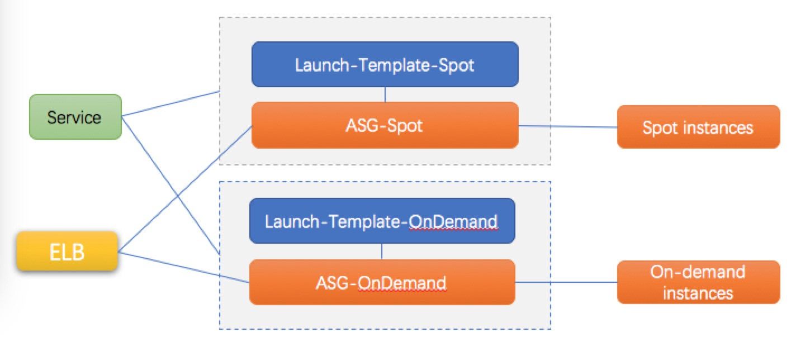
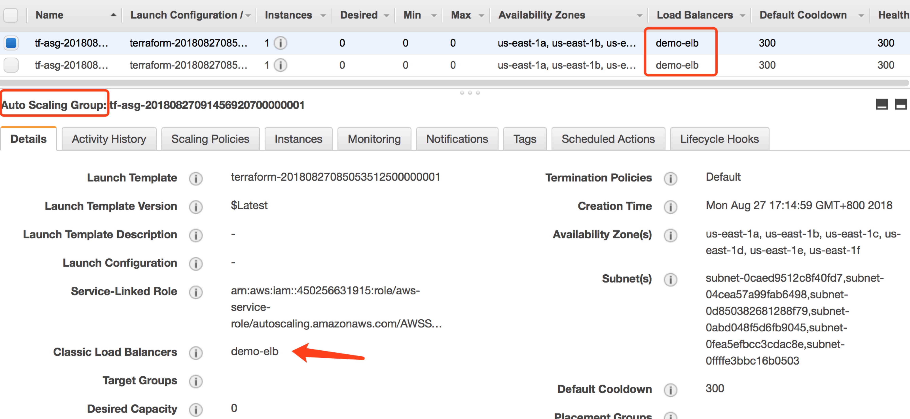
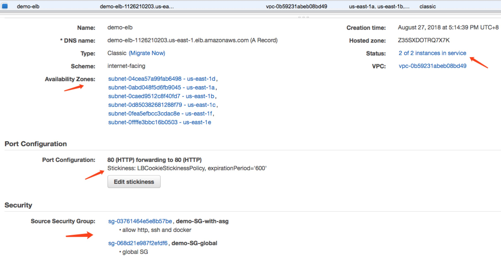
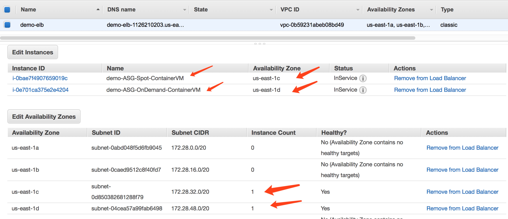
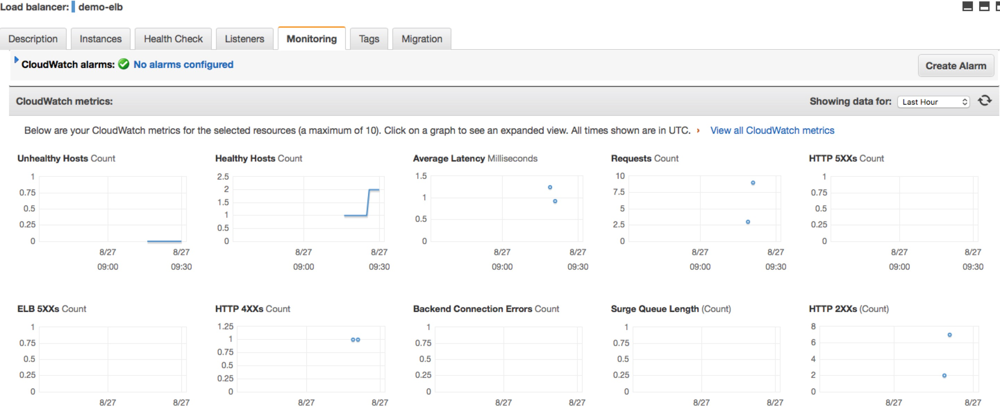

test with LaunchTemplate + ASG + ELB
------------------------------------

Double ASG solution:  

<!-- TOC -->

- [Double ASG solution](#double-asg-solution)
- [ASG related to ELB](#asg-related-to-elb)
- [ELB info](#elb-info)
- [instances registered to ELB](#instances-registered-to-elb)
- [monitoring for ELB](#monitoring-for-elb)

<!-- /TOC -->

# Double ASG solution

- Each service has two ASG, one is for spot instances, another is for on-demand instances
- Update `desired_capacity`, `min_size` and `max_size` to change the number of instances in the ASG.

# ASG related to ELB

The two ASG can be related to a same ELB

# ELB info

# instances registered to ELB

all instances in the two ASG was registered in the ELB

# monitoring for ELB
